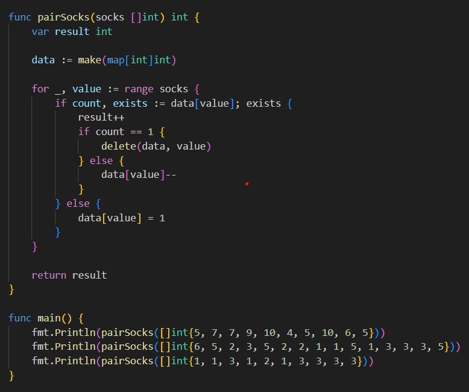
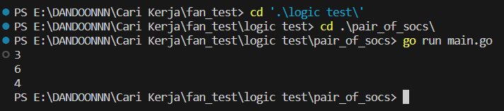
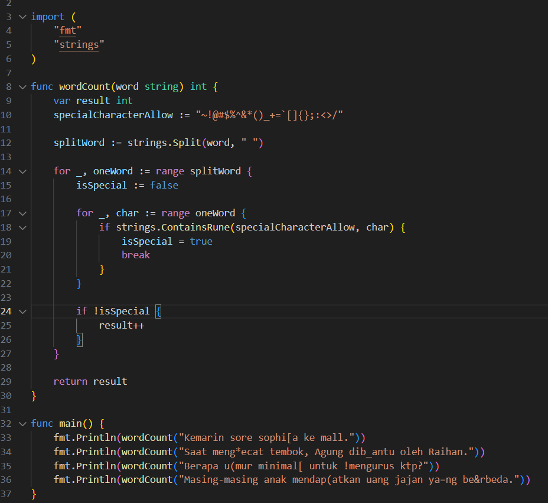
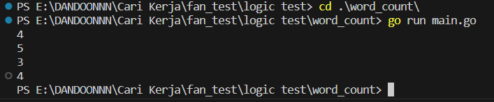
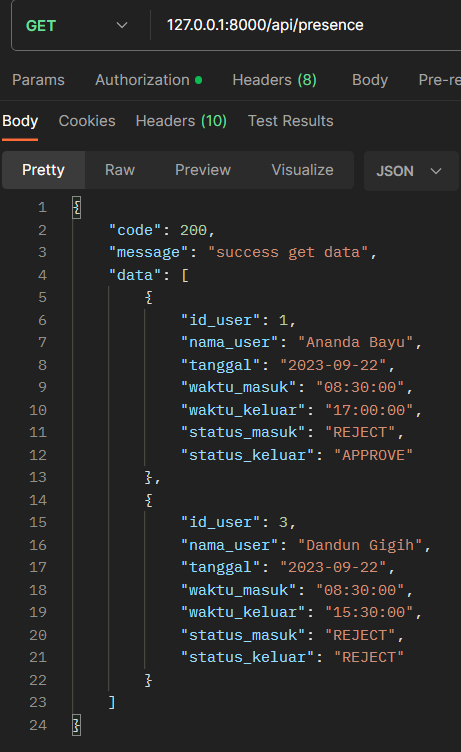

<h1 align="center">Fan Test</h1>
<h2 align="center">Logic Test</h2>

<h2>Pair Of Socks</h2>

    

 
<h2>Output Pair of Socks</h2>

    

 
<h2>Word Count</h2>

 
    Go Version 
    

 
<h2>Output Word Count</h2>

    

<h2 align="center">API Test</h2>

<h2>Body Request</h2>

    

 
<h2>Response Get All Presence</h2>

    

 